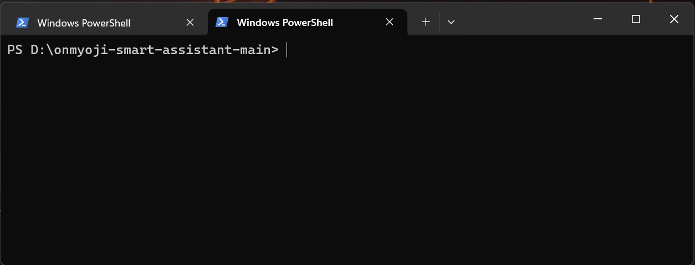
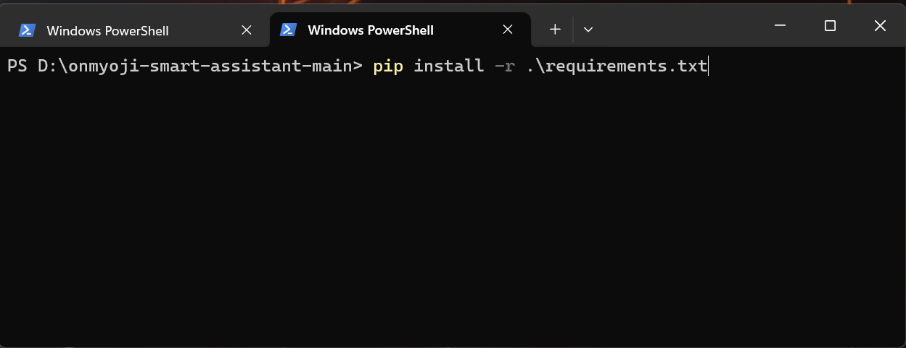
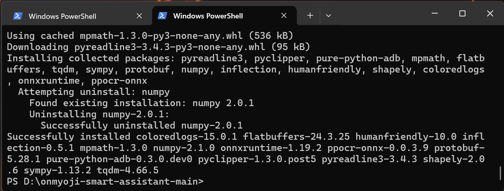
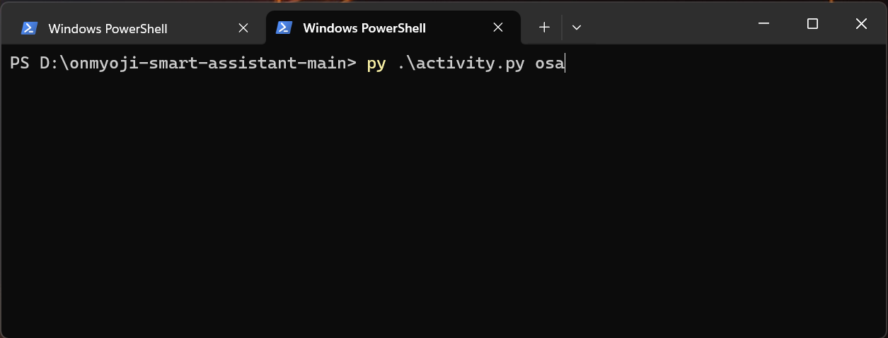
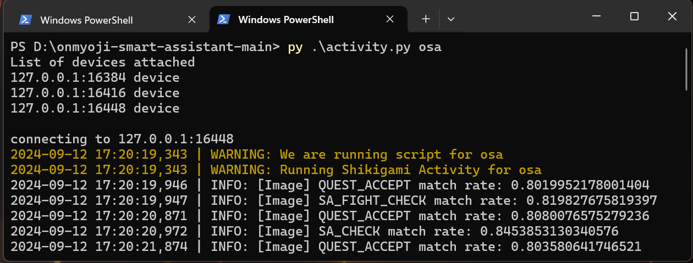

# Onmyoji Smart Assistant

一个简单的阴阳师小助手， 下面是十分潦草的第一版说明
前端基于Flet，但是Flet目前生成含cv2的程序会出错，所以UI开发停滞了

##### Credits
主要参考 [OnmyojiAutoScript](https://github.com/runhey/OnmyojiAutoScript).

## Setup 安装

##### Download 下载

1. 新建一个文件夹
2. 点击本页面上的 `<>code` -> `Download ZIP`
3. 解压缩到一个文件夹 -> 打开文件夹
2. 点击路径栏 -> 双击 -> 复制
3. （Windows） 打开 Command Promp 或者 Terminal
4. 输入 `cd [复制的路径]`  -> 回车

差不多长这样：

##### 基本安装
建新新的python环境：
`python -v venv .venv`

安装库
`pip install -r requirement.txt`

等待安装完成

# 运行

### 修改配置
打开 config目录下的osa.json，修改对应的端口号
需要多号运行的，直接复制一份改名，改端口号就行

### 启动py环境
`.\venv\Scripts\activate`

### 周年庆 999
直接端口运行 `py ./activity.py [script_name]`

例如： `py ./activity.py osa`

### 清厕纸

运行 `py ./errand.py [script_name] -s`

例如: `py ./errand.py osa -s`

这样就是运行成功了：

### 其他活动
之后再慢慢加吧，懂代码的话可以自己修改自己玩
